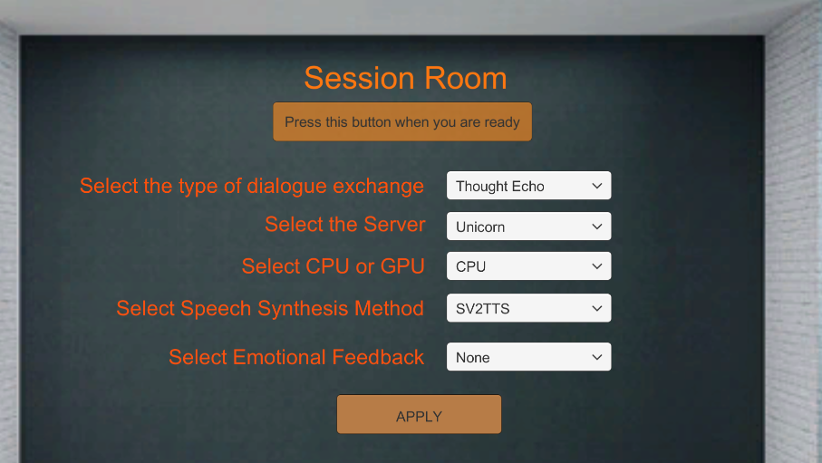
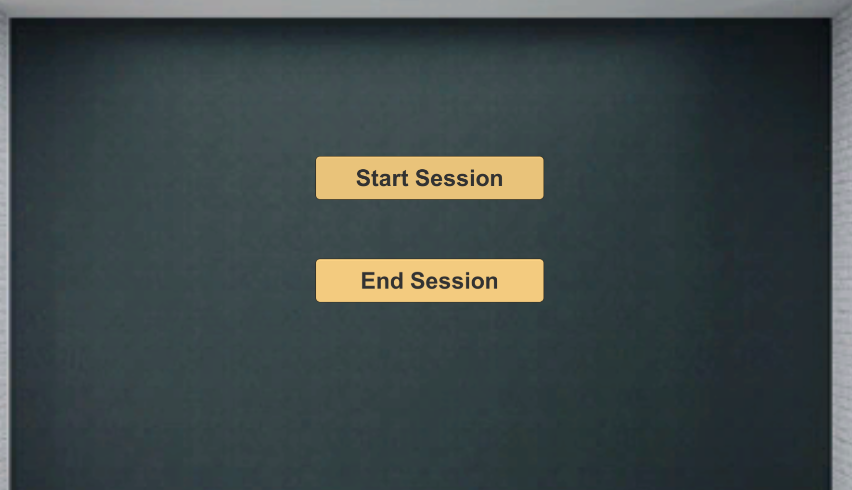
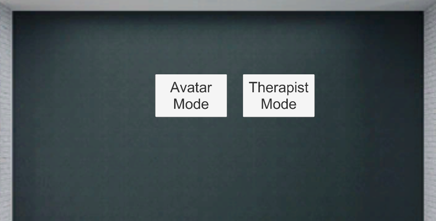
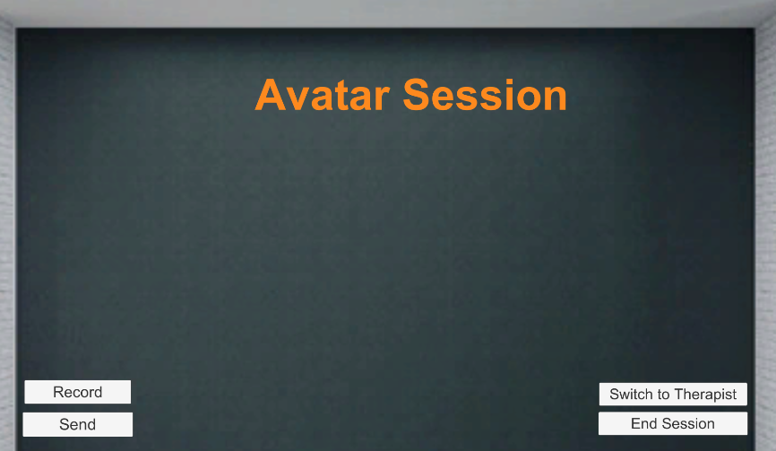
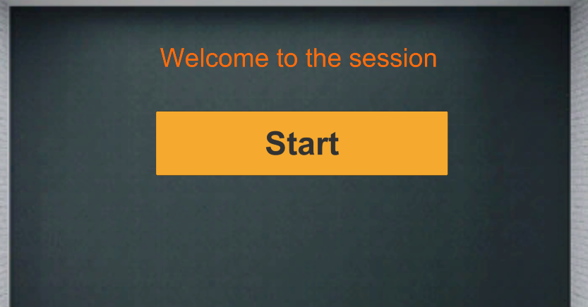
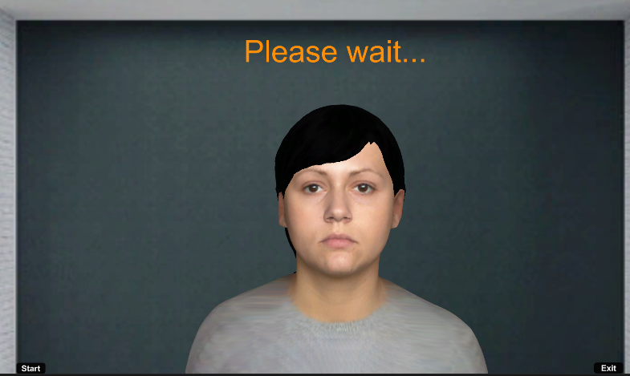
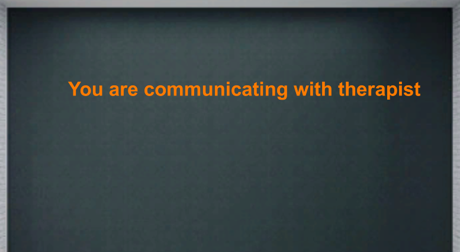
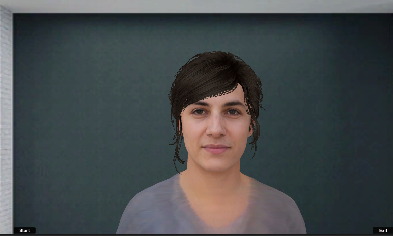
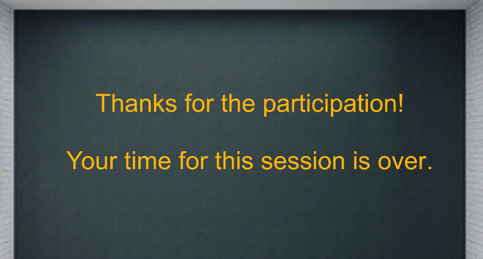

# Psychosis3DAvatar

## Introduction
This is the repository of psychosis pipeline for 3D avatar animation. Our goal of research is to develop an avatar therapy platform for psychosis treatment.
Currently inside this repository there are 2 platforms designed for patient and therapist. The design of Thought Echo platform is focusing on providing an environment with a realistic avatar that could communicate with patients automatically without therapis; The design of Avatar Therapy platform is focusing on providing an environment where therapist could communicate with patient through the bridge of the avatar in front of them in the scene with a change in voice.

To see a quick demo, please watch this [video](https://drive.google.com/file/d/14vXUzp2krtfLef1yW0mjWDI3aELePKSg/view?usp=sharing)

For more introduction, please have a look at this [PPT slides](https://docs.google.com/presentation/d/1P4QAK1GYHZDaZF_Dsa8boNzx7UeFc5-4Bnq7FfV-GAw/edit?usp=sharing)

## Steps to run the project
#### 1. Download this repository and the Agora plugin
Due to the file size limit, part of the Agora plugin cannot be direclt pushed, if the project shows error when opening it, download the remaining plugin [here](https://drive.google.com/drive/folders/1kg8Ky-5PdxB_G8dJnf0l6RXQjDknCstI?usp=sharing) and place them under "Assets\AgoraEngine\Plugins"

#### 2. Run the backend code
Both platforms rely on running the back-end code inside [this repository](), please have a look at the Readme instruction before running the unity project.
Once backend started, you can access the backend from:https://unicorn.cim.mcgill.ca/psychosis/tree/src 
The token is needed for first access after Unicorn’s every reboot
You can access the token by:
  1) Run docker exec -it psychosis-stt-gpt2-tts /bin/bash to get inside the container 
  2) Type jupyter notebook list to see the token

#### 3. Change the IP address

There are 2 types of communication in this platform, remember to change them at the start according to your testing environment: The communication between unity project and backend and the communication between unity 2 unity projects. You need to change the IP address based on your working environment.

The communication between unity project and backend

The communication between 2 unity projects

#### 4. Hit Play and start your session~

Note: We are using TCP socket connection between patient side and therapist side. Where patient side is set as server and therapist side is set as client. So please hit the start button inside patient side first and then hit the start button inside the therapist side. Otherwise, the connection cannot be established successfully.

## Customize your avatar and Lipsync
- The Unity plugin to generate the avatar: [Avatar SDK](https://avatarsdk.com/)
  Process to generate a avatar suitable for LipSync
  1. Create an account under Avatar SDK(remember to unsubscribe! Otherwise it will automatically charge you money!!!)
  2. Select the bust option before uploading the image
  3. Select the blendshape option and export as one model 

- The Unity plugin for lip synchronization: [SALSA LipSync](https://crazyminnowstudio.com/docs/salsa-lip-sync/modules/overview/)

## Detailed introduction on the two projects
### Therapist Side
Important Scenes are under Assets/Scenes folder.
Selection Scene: the starting menu for therapist to make a selection based on he/she preference.
In this scene you have several drop-down selections that could switch between.
The switch between Thought Echo and Avatar Therapy will lead you to scenes with different therapy method.
The selection on server will determine the connection to different backend. (currently the code is only on Unicorn)

#### ThoughtEcho Mode
On entering the ThoughtEcho scene, therapist will be able to control the start and end of the session. Therapist will not be involved in communicating with patients according to the design guideline.

#### Avatar Therapy Mode
There are 2 different modes under the Avatar Therapy session
The design purpose of Avatar Mode is to
In cases where patient prefer not seeing the avatar during the session, therapist could switch to Therapist mode where no avatar will appear on the screen.
The therapist session also has features of speech detection for enhancing user experience.
When therapist decide to end the session, he/she can press the end button and the scene will automatically switch on patient’s side

### Patient side
Welcome Scene: 
Remember to press the start button before pressing the start button in Therapist’s project

#### ThoughtEcho mode
When therapist select Therapist mode, the scene in front of patient will be directly switched to the scene designed for Therapist mode.
We’ve generated several different avatars using Avatar SDK and the scenes inside are called TE1-TE8
You can switch the avatar you want by modifying the Welcome status script from Welcome Scene>Canvas->Status and go to the inspector to see this component.

#### Avatar Therapy mode

The current scene for Avatar Session is “ATF” and the scene for Therapist Session is “ATT”.

 

End Scene:
When the therapist decide to end the session, scene “End” will appppear on the screen.

